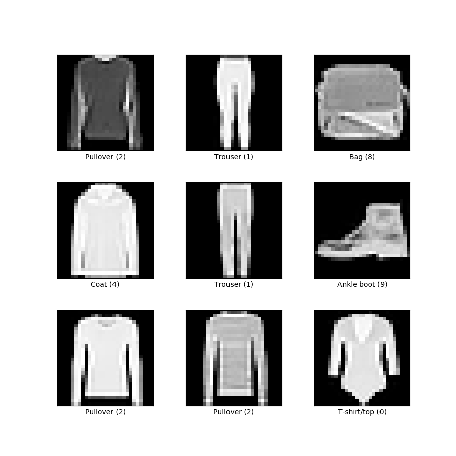

# DeepModel - A C++ Deep Learning Library with CUDA Support

> A high-performance neural network library written from scratch in C++, with optional CUDA support.
> It implements a static backpropagation algorithm to train feed-forward neural networks with simple topology.

---

## Overview

This library is implemented entirely in C++ and has a custom linear algebra engine, which is optimized for both CUDA and CPU-only execution.
Every operation such as matrix transposing, matrix multiplication, and the entire optimization algorithm is implemented by hand.
It also contains its own Dataset class, which gives the user the ability to read and edit .csv datasets.
The GitHub repository contains training examples with MNIST and Fashion-MNIST, and also includes benchmarks against PyTorch.

---

## Features

### Core Features

- **Backpropagation with L2 regularization**
- **Weighted loss support**
- **Random / Xavier / He weight initialization**
- **ADAM and ADAMW**
- **Dataset editing**

### Optimizers
`ADAM_OPTIMIZER` `STOCHASTIC GRADIENT DESCENT` `BATCH GRADIENT DESCENT` `MINI BATCH GRADIENT DESCENT`

### Activation Functions
`RELU`  `IDENTITY`  `ELU`  `SIGMOID`  `LOG_SIGMOID`  `HARD_SIGMOID`  `TANH`  `SOFTMAX`

### Loss Functions
`CROSS ENTROPY`  `QUADRATIC (MLE)`

---

## How to Build

### Requirements

`C++17 GNU / Clang` 
`CMake`
`OpenMP` (Optional for CPU-only version)
`CUDA Toolkit` (Optional for CUDA version)

### CPU-Only

```bash
mkdir build
cmake -B build -DENABLE_CUDA=OFF
cmake --build build
```

### CUDA Support

```bash
mkdir build
cmake -B build -DENABLE_CUDA=ON
cmake --build build
```
### Adding Your Own Files

Add this to the 'CMakeLists.txt':

```cmake
add_executable(my_program my_program.cpp)
target_link_libraries(my_program PRIVATE DeepModel)
```

Then run: 

```bash
cmake --build build
./build/my_program
```

---

## Quick Start

There are multiple examples to view inside /examples.
Here is the training of a network on the MNIST numbers dataset:

**You need to install the MNIST dataset as .csv and place it into the dataset folder to run this program.**
Dataset source: MNIST (LeCun et al., 1998) – available at https://github.com/phoebetronic/mnist


```cpp
#include <iostream>
#include "DeepModel.h"
#include <filesystem>
// Path to the mnist dataset as .csv
const std::string path = "datasets/mnist_train.csv";
int main()
{
    if(!std::filesystem::exists(path))
    {
        std::cerr << "Error : Dataset not found at: " << path << " , please edit path or download & place the mnist_train.csv inside /datasets." << std::endl;
        return 1; 
    }
    // Load dataset and edit it
    Dataset data = Dataset(path);
    data.normalize();
    data.one_hot_encode();
    // Split the dataset and print information
    auto [train, test] = data.split(0.8);
    test.print_information();
    // Create a new network
    NeuralNetwork nn;
    nn.configure_input_layer(784);
    nn.add_layer(64, Activation::RELU);
    nn.add_layer(64, Activation::RELU);
    nn.add_layer(10,  Activation::SOFTMAX);
    nn.configure_loss_function(Loss::CROSS_ENTROPY);
    // Initialise weights
    nn.initalise_he_weights();
    // Configure ADAM
    ADAM_Optimizer adam;
    adam.lr = 0.001;
    adam.batch_size = 64;
    // Run the backpropagation
    nn.fit(30, train, adam);
    // Print accuracy
    nn.performance(test);
    nn.save_weights("mnist_example_weights.txt");
}
```

---


## Benchmark

All configurations were run on a MNIST dataset with 60k samples and the same hyperparameters.
**Furthermore, all random number calculations were performed with the same seed to ensure the reproducibility of the results.**
You can also run them yourself. Everything except the MNIST dataset is included in /benchmarks.

#### Network Architecture:

Neurons                 : 784 x 128 x 128 x 10
Activation functions    : RELU RELU SOFTMAX
Loss function           : Cross entropy

### Mini-Batch SGD
 
| Batch Size | Epochs | DeepModel (CPU) | DeepModel (CUDA) | PyTorch (CPU) |
|:----------:|:------:|-----------------:|------------------:|--------------:|
| 1  | 1  |  3.19s · 89.3% |  3.70s · 86.3% | 26.83s · 91.4% |
| 2  | 1  |  1.81s · 86.8% |  1.87s · 78.1% | 11.44s · 89.1% |
| 4  | 1  |  1.28s · 83.1% |  1.00s · 42.3% |  5.77s · 86.1% |
| 8  | 1  |  1.16s · 74.9% |  0.53s · 18.2% |  2.95s · 69.8% |
| 16 | 20 | 26.05s · 91.9% |  5.50s · 86.0% | 30.29s · 92.5% |
| 32 | 20 | 34.81s · 89.0% |  3.19s · 75.2% | 15.88s · 90.1% |
| 64 | 20 | 46.67s · 85.2% |  2.41s · 49.3% |  8.88s · 86.9% |
 
### Mini-Batch ADAM + L2 Regularization
 
> β₁ = 0.9 · β₂ = 0.999 · ε = 10e-8 · λ = 10e-4
 
| Batch Size | Epochs | DeepModel (CPU) | DeepModel (CUDA) | PyTorch (CPU) |
|:----------:|:------:|-----------------:|------------------:|--------------:|
| 1  | 1  | 12.61s · 92.9% |  7.30s · 92.3% | 68.96s · 95.0% |
| 2  | 1  |  5.04s · 94.5% |  3.75s · 91.2% | 30.95s · 95.7% |
| 4  | 1  |  2.59s · 93.7% |  1.95s · 92.7% | 15.94s · 95.1% |
| 8  | 1  |  2.24s · 93.1% |  0.97s · 89.2% |  7.05s · 95.6% |
| 16 | 20 | 49.16s · 96.5% |  9.97s · 92.8% | 86.18s · 98.0% |
| 32 | 20 | 57.35s · 97.0% |  5.59s · 93.0% | 42.02s · 97.7% |
| 64 | 20 | 64.51s · 96.4% |  4.13s · 93.0% | 19.40s · 97.7% |

### Interpretation of Results

DeepModel outperforms PyTorch (CPU) in training speed on both CPU and CUDA with speedups of 2–10, but achieves lower accuracy on most configurations.
The primary reason for PyTorch's longer runtimes and the accuracy gap is PyTorch's autograd system.
During the forward pass, PyTorch constructs a dynamic directed graph, which contains every mathematical operation and its dependencies.
When backpropagation begins, the gradients are computed by traversing this graph backwards using the chain rule.
This system is far more flexible and is generalized for any network architecture (e.g. CNNs, etc.).
An additional factor is that the PyTorch training loop runs in Python, which is an interpreted language.
DeepModel is written in compiled C++, which eliminates this kind of overhead entirely.
**DeepModel is a static backpropagation algorithm, which can only run a simple feed-forward topology and is not as flexible as PyTorch.**
Due to the reduced overhead and small batch sizes, DeepModel outperforms PyTorch in this case.

Source: https://docs.pytorch.org/tutorials/beginner/blitz/autograd_tutorial.html

### Run the benchmark for yourself

#### DeepModel : CPU-only

```bash
cmake -B build -DENABLE_CUDA=OFF -DBUILD_BENCHMARK=ON
cmake --build build
./build/benchmark/deepmodel_benchmark
```

#### DeepModel : CUDA Support

```bash
cmake -B build -DENABLE_CUDA=ON -DBUILD_BENCHMARK=ON
cmake --build build
./build/benchmark/deepmodel_benchmark
```


#### Pytorch : CPU-only 

```bash
python3 benchmark/pytorch_benchmark.py
```
**Requirements** pandas & pytorch

---


## The Algorithm


### 1 · Basic Backpropagation
 
#### Forward pass
 
$$
z^{(\ell)} = W^{(\ell)} a^{(\ell-1)} + b^{(\ell)}, \qquad a^{(\ell)} = f^{(\ell)} \left(z^{(\ell)}\right)
$$
 
#### Backward pass
 
**Output layer:**
 
$$
\delta^{(L)} = \frac{\partial \mathcal{L}}{\partial a^{(L)}} \odot f'^{(L)} \left(z^{(L)}\right)
$$
 
**Hidden layers** $(\ell = L-1, \dots, 1)$:
 
$$
\delta^{(\ell)} = \left(W^{(\ell+1)}\right)^\top \delta^{(\ell+1)} \odot f'^{(\ell)} \left(z^{(\ell)}\right)
$$
 
### Weight & bias update
 
$$
W^{(\ell)} \leftarrow W^{(\ell)} - \eta  \delta^{(\ell)} \left(a^{(\ell-1)}\right)^\top
$$
 
$$
b^{(\ell)} \leftarrow b^{(\ell)} - \eta  \delta^{(\ell)}
$$

---
 
### 2 · Backpropagation with L2 Regularisation
 
#### Regularised objective
 
$$
\mathcal{J} = \mathcal{L}(\hat{y},\, y) + \frac{\lambda}{2N} \sum_{\ell=1}^{L} \left\||W^{(\ell)}\right\||^2
$$

The $\delta$ computation is identical to Section 1. Only the weight update gains a decay term:
 
### Weight update (weight decay + gradient step)
 
$$
W^{(\ell)} \leftarrow W^{(\ell)} \left(1 - \frac{\eta\lambda}{N}\right) - \eta  \delta^{(\ell)} \left(a^{(\ell-1)}\right)^\top
$$
 
$$
b^{(\ell)} \leftarrow b^{(\ell)} - \eta \delta^{(\ell)}
$$
 
 
---
 
### 3 · Backpropagation with Adam
 
The $\delta$ computation is identical to Section 1. Adam replaces the vanilla gradient step with an adaptive moment-based update.
 
**Hyperparameters:** $\beta_1$, $\beta_2$, $\varepsilon$
 
Let $g_t = \delta^{(\ell)} \left(a^{(\ell-1)}\right)^\top$ be the gradient at step $t$.
 
#### 1st moment (mean)
 
$$
m_t = \beta_1\ m_{t-1} + (1 - \beta_1)\ g_t
$$
 
#### 2nd moment (uncentred variance)
 
$$
v_t = \beta_2\ v_{t-1} + (1 - \beta_2)\ g_t^2
$$
 
#### Bias-corrected estimates
 
$$
\hat{m}_t = \frac{m_t}{1 - \beta_1^t}, \qquad \hat{v}_t = \frac{v_t}{1 - \beta_2^t}
$$
 
#### Weight update
 
$$
W^{(\ell)} \leftarrow W^{(\ell)} - \eta \frac{\hat{m}_t}{\sqrt{\hat{v}_t} + \varepsilon}
$$


---
## Examples
 
There are 3 examples.
 
1. Training on the MNIST dataset with ADAM.
2. Training on the Fashion-MNIST dataset with ADAM.
3. Matrix operations with the linear algebra engine.
 

#### CPU-Only build
 
```bash
cmake -B build -DENABLE_CUDA=OFF -DBUILD_EXAMPLES=ON
cmake --build build
```
 
#### CUDA Support build
 
```bash
cmake -B build -DENABLE_CUDA=ON -DBUILD_EXAMPLES=ON
cmake --build build
```
 
#### 1 · MNIST:


*Figure 1: Sample digits from the MNIST dataset (LeCun et al., 1998). Image by Josef Steppan, [CC BY-SA 4.0](https://creativecommons.org/licenses/by-sa/4.0/), via Wikimedia Commons.*

In this example we train a network on pictures of digit's to classify them correctly.

**Run with:**

```bash
./build/mnist
```
**Requires the MNIST dataset as .csv**  
Place it into /datasets with the name 'mnist_train.csv'.
Dataset source: MNIST (LeCun et al., 1998) – available at https://github.com/phoebetronic/mnist

#### 2 · Fashion-MNIST:



*Figure 2: Sample images from the Fashion-MNIST dataset (Xiao et al., 2017). Source: [TensorFlow Datasets](https://www.tensorflow.org/datasets/catalog/fashion_mnist), [CC BY 4.0](https://creativecommons.org/licenses/by/4.0/).*


In this example we train a network on pictures of various clothings to classify them correctly.

**Run with:**
```bash
./build/fashion_mnist
```
**Requires the Fashion-MNIST dataset as .csv**  
Place it into /datasets with the name 'fashion_mnist.csv'.
Dataset source: Fashion-MNIST (Xiao et al., 2017) – available at https://github.com/zalandoresearch/fashion-mnist

#### 3 · Linear Algebra:
```bash
./build/linear_algebra
```

--- 

## API Reference
 
### `NeuralNetwork`
 
| Method | Description |
|--------|-------------|
| `configure_input_layer(n)` | Set input dimensionality. |
| `add_layer(size, activation_type)` | Append a fully-connected layer. Possible inputs for `activation_type` listed below. |
| `configure_loss_function(loss_type)` | Set training loss. Possible values for `loss_type` listed below. |
| `initalise_random_weights()` | Sets random weights in the range [-0.1, 0.1]. |
| `initalise_random_weights(begin, end)` | Sets random weights in the range [begin, end]. |
| `initalise_xavier_weights()` | Xavier initialisation. |
| `initalise_he_weights()` | He initialisation. |
| `fit(epochs, dataset, optimizer_type, learnrate)` | Runs the training loop for SGD, BGD, or mini-batch GD (batch size = 64). See Optimizer types for possible `optimizer_type` values. |
| `fit(epochs, dataset, optimizer_type, learnrate, batch_size)` | Runs the training loop with a manually set batch size (works only for mini-batch GD). See Optimizer types for possible `optimizer_type` values. |
| `fit(epochs, dataset, ADAM_Optimizer)` | Runs the training loop with an ADAM optimizer. See ADAM for correct initialisation. |
| `set_loss_weights(weights)` | Sets loss weights with a `vector<size_t>` of the size of the output layer. |
| `accurracy(dataset)` | Returns the accuracy for a dataset. |
| `performance(dataset)` | Prints the accuracy for a dataset. |
| `save_weights(path)` | Stores weights to a file. |
| `load_weights(path)` | Reads weights from a file. |
 
### `Dataset`
 
| Method | Description |
|--------|-------------|
| `Dataset(path)` | Reads a .csv file with the label in column 0. |
| `Dataset(path, label_col)` | Reads a .csv file with the label at index `label_col`. |
| `Dataset(path, ignore, label_col)` | Reads a .csv file with the label at index `label_col` and ignores all rows at indices inside the vector `ignore`. |
| `standardize()` | Standardizes all features. |
| `normalize()` | Min-max normalizes all features. |
| `one_hot_encode()` | Converts labels into one-hot encoded vectors. |
| `split(ratio)` | Returns a `[train, test]` pair. |
| `sample_size()` | Returns the number of samples. |
| `input_dim()` | Returns the number of rows of one input vector. |
| `expected_dim()` | Returns the number of rows of one expected vector. |
| `print_information()` | Prints sample count, input dimension, and expected dimension. |
 
### `Matrix`
 
This class also allows operations on stacked matrices.
 
| Method | Description |
|--------|-------------|
| `Matrix(rows, columns)` | Creates an empty matrix. |
| `Matrix(rows, columns, value)` | Initialises the matrix with all elements set to `value`. |
| `Matrix(rows, columns, values)` | Creates a matrix and sets all elements to the values of the vector `values`. |
| `Matrix(rows, columns, begin, end)` | Initialises random values from [begin, end]. |
| `create_stacked_matrix(rows, columns, height)` | Creates an empty stacked matrix. All variations from above work for this function as well, and all functions are implemented for stacked matrices. |
| `slice_stacked_matrix(start, end)` | Creates a view of a stacked matrix from [start, end[. |
| `reduce_sum(matrix)` | Returns the sum across all stacks of a matrix. |
| `min()` | Returns a matrix containing only the minimum element. |
| `max()` | Returns a matrix containing only the maximum element. |
| `argmin()` | Returns a vector containing the argmin for each matrix. |
| `argmax()` | Returns a vector containing the argmax for each matrix. |
| `set(value)` | Sets all elements to `value`. |
| `matrix % matrix` | Hadamard product. |
| `matrix * matrix` | Matrix multiplication. |
| `matrix +/- matrix` | Addition / Subtraction. |
| `matrix */+/- float` | Scaling, adding, or subtracting by constant values. |
 
The linear algebra engine also contains overloaded operators, which allow the user to use matrix multiplication, Hadamard products, addition, scaling, and automatic broadcasting between different stack sizes.
 
Example:
 
```c++
    // Create a stacked matrix of shape 5x1x100 with random values from 0 to 2.
    Matrix data = Matrix::create_stacked_matrix(5, 1, 100, 0, 2.0f);
 
    const float n = (float)data.height();
    
    // Calculate the mean by summing all stacked matrices and dividing by height.
    Matrix mean = Matrix::reduce_sum(data) * (1/n);    // shape 5x1x1
 
    // Calculate the variance by squaring all elements and summing the squared values.
    Matrix variance = Matrix::reduce_sum(Matrix::square(data)) * (1/n); // shape 5x1x1
 
    // Take the square root to get the standard deviation.
    Matrix standard_deviation = Matrix::sqrt(variance);
 
    // Standardize the data using the built-in broadcasting rules:
    // data               -> shape 5x1x100
    // mean               -> shape 5x1x1
    // standard_deviation -> shape 5x1x1
    // => the subtraction and the Hadamard product will be broadcast to all values.
 
    Matrix standardized_data = (data - mean) % Matrix::reciprocal(standard_deviation); 
```
 
 
### `Optimizer types`
| optimizer_type |
|--------|
| `Optimizer::STOCHASTIC_GRADIENT_DESCENT` |
| `Optimizer::BATCH_GRADIENT_DESCENT` |
| `Optimizer::MINI_BATCH_GRADIENT_DESCENT` |
 
### `Loss functions`
| loss_type |
|--------|
| `Loss::MSE` |
| `Loss::CROSS_ENTROPY` |
 
### `Activation functions`
| activation_type |
|--------|
| `Activation::IDENTITY` |
| `Activation::RELU` |
| `Activation::ELU` |
| `Activation::SIGMOID` |
| `Activation::LOG_SIGMOID` |
| `Activation::HARD_SIGMOID` |
| `Activation::TANH` |
| `Activation::SOFTMAX` |
 
### `ADAM`
 
The default configuration for ADAM:
```c++
ADAM_Optimizer adam;
adam.lr = 0.1;
adam.beta1 = 0.9;
adam.beta2 = 0.999;
adam.epsilon = 10e-8;
adam.lambda = 10e-4;
adam.batch_size = 64;
```
 
If you wish to use a default value, you do not need to specify it.
 
---